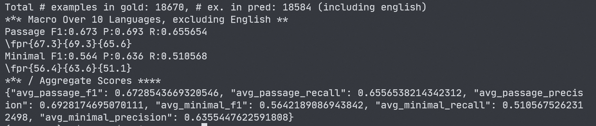

# CANINE

使用 Paddle 实现 CANINE-S 模型。
## 目录
- [CANINE](#canine)
  - [目录](#目录)
  - [1. 简介](#1-简介)
  - [2. 数据集和复现精度](#2-数据集和复现精度)
  - [3. 环境准备](#3-环境准备)
    - [3.1 设备环境](#31-设备环境)
    - [3.2 数据准备](#32-数据准备)
      - [3.2.1 下载Tydi数据集](#321-下载tydi数据集)
      - [3.2.2 处理数据集](#322-处理数据集)
    - [3.3 模型准备](#33-模型准备)
      - [3.3.1 预训练权重准备](#331-预训练权重准备)
      - [3.3.2 前向传导核对精度](#332-前向传导核对精度)
  - [4 模型使用](#4-模型使用)
    - [4.1 使用案例](#41-使用案例)
    - [4.2 TydiQA 任务复现](#42-tydiqa-任务复现)
      - [4.2.1 模型训练](#421-模型训练)
      - [4.2.2 tydi任务评测](#422-tydi任务评测)
      - [4.2.3 复现结果](#423-复现结果)
  - [5. 模型推理部署](#5-模型推理部署)
  - [6. 自动化测试脚本](#6-自动化测试脚本)
  - [7.LICENSE](#7LICENSE)
  - [8.参考链接](#8参考链接)
## 1. 简介

世界上存在海量的语言与词汇，在处理多语言场景时，传统预训练模型采用的 Vocab 和 Tokenization 方案难免会遇到 out of vocabulary 和 unkonw token 的情况。Canine 提供了 tokenization-free 的预训练模型方案，提高了模型在多语言任务下的能力。

论文链接：[CANINE: Pre-training an Efficient Tokenization-Free Encoder for Language Representation](https://paperswithcode.com/paper/canine-pre-training-an-efficient-tokenization)
参考repo：[google-research/language](https://github.com/google-research/language/tree/master/language/canine)，[huggingface/transformers](https://github.com/huggingface/transformers/tree/main/src/transformers/models/canine)。

## 2. 数据集和复现精度

本次复现使用 tydiqa 数据集 [tydiqa 官方repo](https://github.com/google-research-datasets/tydiqa)，数据处理操作参考了 [canine/tydiqa 官方](https://github.com/google-research/language/tree/master/language/canine/tydiqa)。

TydiQA 为多语言阅读理解数据集。文章从wiki百科中爬取，题目以及对应的标注由人工实现。Tydi数据库中包含了 18万+篇 wiki 百科预料，20万+ 文章与问题对，共涉及 11 种不同的语言。Canine 在TydiQA 上实现了 Selection Passage Task 66% F1及 Minimum Answer Span Task 58% F1 的精度，比 TydiQA 基线（mBERT）高出约 2%。

| TydiQA 任务                        | Canine 论文精度 | 本仓库复现精度 |
| ---------------------------------- | --------------- | -------------- |
| Passage Selection Task (SELECTP)   | 66.0%           | 65.83%         |
| Minimal Answer Span Task (MINSPAN) | 52.8%           | 55.27%         |

指标为macro F1；本仓库展示的复现结果为多次微调、预测、评估后的平均值。

## 3. 环境准备

### 3.1 设备环境

+ 硬件：GPU V100 32G；内存32GB或以上。
+ 框架：paddlepaddle==2.3.0

canine paddle依赖：

```shell
paddlenlp==2.3.1
h5py
```

权重转换及tydiQA任务环境：

```shell
transformers==4.19.2
torch==1.11.0
absl-py
```

### 3.2 数据准备

#### 3.2.1 下载Tydi数据集

```shell
mkdir data/tydi || echo "dir exist"
wget -O data/tydi/tydiqa-v1.0-dev.jsonl.gz https://storage.googleapis.com/tydiqa/v1.0/tydiqa-v1.0-dev.jsonl.gz
wget -O data/tydi/tydiqa-v1.0-train.jsonl.gz https://storage.googleapis.com/tydiqa/v1.0/tydiqa-v1.0-train.jsonl.gz
```

【备选】可以直接在 tydiqa 仓库 [Download the Dataset](https://github.com/google-research-datasets/tydiqa#download-the-dataset)中下载，放置在 `data/tydi` 目录下。

#### 3.2.2 处理数据集

**注意：** 由于 canine 仓库默认将 tydi 数据处理成 tensorflow 训练用格式，因此在复现时，个人更改了部分数据储存方式以适配 paddle 的训练，详细的数据处理配置在 [tydi_canine](tydi_canine/readme.md) 文件夹中查看。

**方案一：直接下载并解压处理好的训练和测试数据。**

+ 链接：https://pan.baidu.com/s/1QVHh3cTztKAgAEEXUlqxWg?pwd=ia6i ；提取码：ia6i 

下载后将两个 h5df 数据库放在 `data/tydi` 目录，如下：

```python
./canine_paddle            # 仓库根目录
|--data                    # 仓库数据目录
|   ├── tydi               # tydi数据
|        ├── dev.h5df      # 从tydiqa-v1.0-dev.jsonl.gz提取的测试数据  
|        ├── train.h5df    # 从tydiqa-v1.0-train.jsonl.gz提取的训练数据 
```

**方案二：处理官方的原数据集**

执行以下代码生成测试数据集，用时约30分钟，生成数据大小2.5GB，包括35万+个样本。

```shell
python3 -m tydi_canine.prepare_tydi_data \
  --input_jsonl="**/tydiqa-v1.0-dev.jsonl.gz" \
  --output_dir=data/tydi/dev.h5df \
  --max_seq_length=2048 \
  --doc_stride=512 \
  --max_question_length=256 \
  --is_training=false
```

执行以下代码生成训练数据集，用时约2小时，生成数据大小1.4GB，包括46万+ 个样本。

```shell
python3 -m tydi_canine.prepare_tydi_data \
  --input_jsonl="**/tydiqa-v1.0-train.jsonl.gz" \
  --output_dir=data/tydi/train.h5df \
  --max_seq_length=2048 \
  --doc_stride=512 \
  --max_question_length=256 \
  --include_unknowns=0.1 \
  --is_training=true
```

### 3.3 模型准备

#### 3.3.1 预训练权重准备

**方案一：下载转换好的预训练权重**

+ 百度网盘链接：https://pan.baidu.com/s/1RO2MAyS3LHNHA5BwtDja9A  ；提取码：dk1t 

请将下载好的权重放置于仓库中的 `data/paddle_weight/model_state.pdparams`

**方案二：根据torch 权重进行预训练权重转换**

+ 下载 torch 权重到本地：

```shell
mkdir -p data/torch_weight || echo "dir exist"
wget -O data/torch_weight/pytorch_model.bin https://huggingface.co/google/canine-s/resolve/main/pytorch_model.bin
```

【备选】可以在 [huggingface canine-s](https://huggingface.co/google/canine-s/tree/main) 网站手动下载，保存到 `data/torch_weight/pytorch_model.bin`

+ 权重转换：

```shell
mkdir -p data/paddle_weight || echo "dir exist"
python -m reproduction_utils.weight_convert_files.convert_weight \
  --pytorch_checkpoint_path=data/torch_weight/pytorch_model.bin \
  --paddle_dump_path=data/paddle_weight/model_state.pdparams \
  --layer_mapping_file=reproduction_utils/weight_convert_files/torch_paddle_layer_map.json
```

`--pytorch_checkpoint_path` ：torch权重路径。

`--paddle_dump_path`：转换paddle权重输出路径。

`--layer_mapping_file`：提供从torch layer对应到paddle layer的json文件

#### 3.3.2 前向传导核对精度

（执行该步需要安装torch与transformers）请在 CPU 环境下进行前项传导核对。

```shell
python -m reproduction_utils.token_check
python -m reproduction_utils.forward_ppg_check
```

验证过程中，运行 torch canine 模型时会出现  `Using unk_token, but it is not set yet.` ，属于正常提示。经过多次随机样本验证，paddle模型与huggingface模型精度能保持在 $e^{-5}$ 至 $e^{-7}$ 级别。

## 4 模型使用

### 4.1 使用案例

```python
from canine import CanineTokenizer
from canine import CanineModel

tokenizer = CanineTokenizer.from_pretrained("canine-s")
model = CanineModel.from_pretrained("canine-s")
text = ["canine is tokenization-free"]

inputs = tokenizer(text,
                     padding="longest",
                     return_attention_mask=True,
                     return_token_type_ids=True, )
pd_inputs = {k: paddle.to_tensor(v) for (k, v) in inputs.items()}
seq_outputs, pooling_outputs = model(**pd_inputs)
```

### 4.2 TydiQA 任务复现

训练参数信息可在 `run_tydi.py` 中查看。关于训练的超参、优化器、loss等选择，请查看根目录下的 [note.md](note.md)。

**注意：** 由于官方论文中并没有提到微调的参数配置，因此本次复现参考并分别尝试了 [canine官方仓库](https://github.com/google-research/language/tree/master/language/canine/tydiqa#train-fine-tuning-canine) 的微调配置（`batch_size=512`，`epoch=10`, `lr=5e-5`），以及 [tydiqa 基线仓库]() 的微调配置（`batch_size=16`,`epoch=3`, `lr=5e-5`）。其中 `batch_size=512` 通过梯度累加来近似模拟。

实验中发现，10个epoch训练存在明显的过拟合，并且3个epoch的效果普遍比10个epoch高出2-3%。

#### 4.2.1 模型训练

单卡 V100 32G 训练需要8小时（多卡仅需改动`--selected_gpus` 为 `0,1,2,3`）。

```shell
python -m paddle.distributed.launch --selected_gpus='0' run_tydi.py \
  --train_input_dir=data/tydi/train.h5df \
  --do_train \
  --max_seq_length=2048 \
  --train_batch_size=16 \
  --learning_rate=5e-5 \
  --num_train_epochs=3 \
  --warmup_proportion=0.1 \
  --logging_steps=1000\
  --seed=2020 \
  --fp16 \
  --gradient_accumulation_steps=1 \
  --output_dir=data/tydiqa_baseline_model/train
```

`--train_input_dir`：存放 h5df 数据集的路径。

`--output_dir`：输出模型权重、训练日志的文件夹路径。

#### 4.2.2 tydi任务评测

> 根据 [tydi 官方](https://github.com/google-research-datasets/tydiqa#evaluation) 指示进行评测。 
>我们使用训练结束的权重进行测试，不考虑中间的checkout poing。

**步骤一：** 运行以下代码，生成任务评测文件 `pred.jsonl` ，由于 tydiQA任务的评估方式较为特殊，因此可以采用单卡或者多卡进行（多卡仅需改动`--selected_gpus` 为 `0,1,2,3`）：

```shell
python3 -m paddle.distributed.launch --selected_gpus='0' run_tydi.py \
  --state_dict_path=data/tydiqa_baseline_model/train \
  --predict_file=data/tydi/tydiqa-v1.0-dev.jsonl.gz \
  --precomputed_predict_file=data/tydi/dev.h5df \
  --do_predict \
  --max_seq_length=2048 \
  --max_answer_length=100 \
  --candidate_beam=30 \
  --predict_batch_size=32 \
  --logging_steps=100 \
  --seed=2020 \
  --output_dir=data/tydiqa_baseline_model/predict \
  --output_prediction_file=data/tydiqa_baseline_model/predict/pred.jsonl
```

`--state_dict_path`：存放微调权重的文件路径；若为文件夹路径，则会读取该文件夹下的 `tydi_seed_{seed}.pdparams` 权重。

`--predict_file`：从官方下载的 `tydiqa-v1.0-dev.jsonl.gz` 文件路径。

`--output_dir`：输出运行日志

`--output_prediction_file`：输出 JSON 评估文件路径。

**【备注】**   `pred.jsonl` 为格式满足 TydiQA 评测要求的文件，格式要求可以参考：[TydiQA 评测文件示例](https://github.com/google-research-datasets/tydiqa/blob/master/sample_prediction.jsonl)。

**步骤二：** 运行 tydi 官方跑分程序：将 `predictions_path` 对应到上一步中的 `pred.jsonl` 位置。

其中 Tydi 测评所需要的 `tydi_eval.py`, `eval_utils.py` 源于 [tydi 官方](https://github.com/google-research-datasets/tydiqa#evaluation)。

```shell
python3 official_tydi/tydi_eval.py \
  --gold_path=data/tydi/tydiqa-v1.0-dev.jsonl.gz \
  --predictions_path=data/tydiqa_baseline_model/predict/pred.jsonl
```

`--gold_path`：从官方下载的 `tydiqa-v1.0-dev.jsonl.gz` 文件路径。

`--predictions_path`：步骤一种输出 JSON 评估文件的路径。

得到运行结果如下图：



**步骤三：** 清理过程文件

在 `data/tydiqa_baseline_model/predict` 文件夹下会生成用于储存 logits 的 `results_gpu_*.pickle` 文件。测试结束后可以将其删除。

#### 4.2.3 复现结果

以下复现结果为多次微调、预测、评估后的 macro F1 平均值：

| TydiQA 任务                        | Canine 论文精度 | 本仓库复现精度 |
| ---------------------------------- | --------------- | -------------- |
| Passage Selection Task (SELECTP)   | 66.0%           | 65.83%         |
| Minimal Answer Span Task (MINSPAN) | 52.8%           | 55.27%         |

各次微调的日志、评估文件等可以在 `logs` 文件夹中查看。训练结果整理：

|                     | batch size | acc grad steps | 理论 batch size | seed | epoch | TydiQA SelectP F1 | TydiQA MinSpan F1 | 微调权重链接                                                 |
| ------------------- | ---------- | -------------- | --------------- | ---- | ----- | ----------------- | ----------------- | ------------------------------------------------------------ |
| V100                | 16         | 1              | 16              | 2021 | 3     | 66.01%            | 55.77%            | [百度网盘](https://pan.baidu.com/s/1zlGq0alZB04vbpl1lS77uw?pwd=xldb) |
| V100                | 16         | 1              | 16              | 666  | 3     | 67.02%            | 56.17%            | [百度网盘](https://pan.baidu.com/s/1jr8bh2-BKX-DRtclkGl5xA?pwd=wyus) |
| v100                | 16         | 32             | 512             | 5121 | 10    | 64.35%            | 53.58%            |                                                              |
| 3090*4              | 14         | 9              | 504             | 5123 | 4     | 65.93%            | 55.60%            |                                                              |
| ...还有两个正在测试 |            |                |                 |      |       |                   |                   |                                                              |
| 平均                | -          | -              | -               |      | -     | 65.83%            | 55.27%            |                                                              |

此外，以下展示了 **所有** 复现过程中进行过的其他微调结果，由于参数配置问题，他们不被计入论文复现精度，但仍可以为该模型在Tydi任务上的训练效果提供一些信息。

| 设备   | batch size | acc grad steps | 理论 batch size | seed | 混合精度训练 | epoch | warm up | TydiQA SelectP F1 | TydiQA MinSpan F1 |
| ------ | ---------- | -------------- | --------------- | ---- | ------------ | ----- | ------- | ----------------- | ----------------- |
| V100*1 | 20         | 25             | 500             | 6    | 否           | 10    | 0.01    | 64.38%            | 53.73%            |
| 3090*4 | 10         | 12             | 480             | 6    | 否           | 10    | 0.01    | 65.23%            | 53.49%            |
| 3090*4 | 10         | 1              | 40              | 6    | 否           | 10    | 0.01    | 67.31%            | 53.11%            |
| V100*4 | 16         | 1              | 64              | 2022 | 是           | **3** | 0.01    | 67.26%            | 56.41%            |
| V100*4 | 16         | 1              | 64              | 2020 | 是           | **3** | 0.01    | 67.29%            | 56.42%            |
| -      | -          | -              | -               | -    | -            | -     | -       | **66.29%**        | **54.63%**        |

**备注：**

+ 官方 warm up 比例为 0.1；
+ 此处`理论 batch_size` = `batch_size` * `accumulate_gradient_steps` * `number_GPU`
+ 除上述两者外，其他训练配置均与官方相同。
+ 在 [Tydi Leaderboard](https://ai.google.com/research/tydiqa) 上，TydiQA SelectP 任务的 Top5/Top1 成绩为 72.5%/79.5%。而 TydiQA MinSpan 的 Top5/Top1 成绩为 63.4%/72.35%。canine 与 SOTA 还是有点差距的。

## 5. 模型推理部署

TODO

## 6. 自动化测试脚本

TODO

## 7. LICENSE

本项目的发布受[Apache 2.0 license](https://github.com/JunnYu/xlm_paddle/blob/main/LICENSE)许可认证。

## 8. 参考链接

+ https://paperswithcode.com/paper/canine-pre-training-an-efficient-tokenization
+ https://github.com/google-research/language/tree/master/language/canine
+ https://github.com/huggingface/transformers/tree/main/src/transformers/models/canine

+ https://github.com/google-research-datasets/tydiqa
