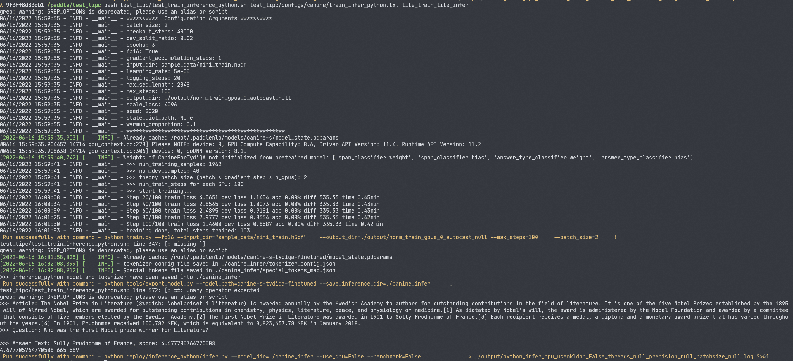

# Linux端基础训练推理功能测试

Linux端基础训练推理功能测试的主程序为`test_train_inference_python.sh`，可以测试基于Python的模型训练、评估、推理等基本功能，包括裁剪、量化、蒸馏。

## 1. 测试结论汇总

- 训练相关：

| 算法名称 | 模型名称 | 单机单卡 | 单机多卡 | 多机多卡 | 模型压缩（单机多卡） |
| -------- | -------- | -------- | -------- | -------- | -------------------- |
| CANINE   | CANINE-S | 正常训练 | 正常训练 | -        | -                    |

- 推理相关：基于训练是否使用量化，可以将训练产出的模型可以分为`正常模型`和`量化模型`，这两类模型对应的推理功能汇总如下，

| 算法名称 | 模型名称 | 模型类型 | device | batchsize | tensorrt | mkldnn | cpu多线程 |
| -------- | -------- | -------- | ------ | --------- | -------- | ------ | --------- |
| CANINE   | CANINE-S | 正常模型 | GPU    | 1         | -        | -      | -         |
| CANINE   | CANINE-S | 正常模型 | CPU    | 1         | -        | -      | -         |

## 2. 测试流程

### 2.1 准备数据

用于基础训练推理测试的数据位于`sample_data/mini_train.h5df`，其中储存了2000+ 个 TydiQA 阅读理解数据样本。关于 TydiQA 数据集的预处理流程，请参考 [canine_paddle/tydi_canine](https://github.com/kevinng77/canine_paddle/tree/main/tydi_canine)。

### 2.2 准备环境

- 安装PaddlePaddle >= 2.3

- 安装canine依赖

  ```shell
  pip install paddlenlp
  ```

- 安装数据集依赖

  ```shell
  pip install h5py
  ```

- 安装AutoLog（规范化日志输出工具）

  ```
  git clone https://github.com/LDOUBLEV/AutoLog
  cd AutoLog
  pip install -r requirements.txt
  python setup.py bdist_wheel
  pip3 install ./dist/auto_log-1.0.0-py3-none-any.whl
  cd ../
  ```

### 2.3 功能测试



测试方法如下所示，希望测试不同的模型文件，只需更换为自己的参数配置文件，即可完成对应模型的测试。

```
bash test_tipc/test_train_inference_python.sh ${your_params_file} lite_train_lite_infer
```

以`canine`的`Linux GPU/CPU 基础训练推理测试`为例，命令如下所示。

```
bash test_tipc/test_train_inference_python.sh test_tipc/configs/AlexNet/train_infer_python.txt lite_train_lite_infer
```

`output/result_python.log`输出结果如下，表示命令运行成功。

```shell
[33m Run successfully with command - python train.py --fp16 --input_dir="../data/tydi/train.h5df"    --output_dir=./output/norm_train_gpus_0_autocast_null --max_steps=100     --batch_size=2     !  
[33m Run successfully with command - python tools/export_model.py --model_path=./canine_tydi_qa --save_inference_dir=./canine_infer      !  
[33m Run successfully with command - python deploy/inference_python/infer.py --model_dir=./canine_infer --use_gpu=False --benchmark=False               > ./output/python_infer_cpu_usemkldnn_False_threads_null_precision_null_batchsize_null.log 2>&1 !  
```

## 3. 更多教程

本文档为功能测试用，更丰富的训练预测使用教程请参考：

- [模型训练、预测、推理教程](https://github.com/PaddlePaddle/models/blob/release/2.2/tutorials/tipc/train_infer_python/template/README.md)