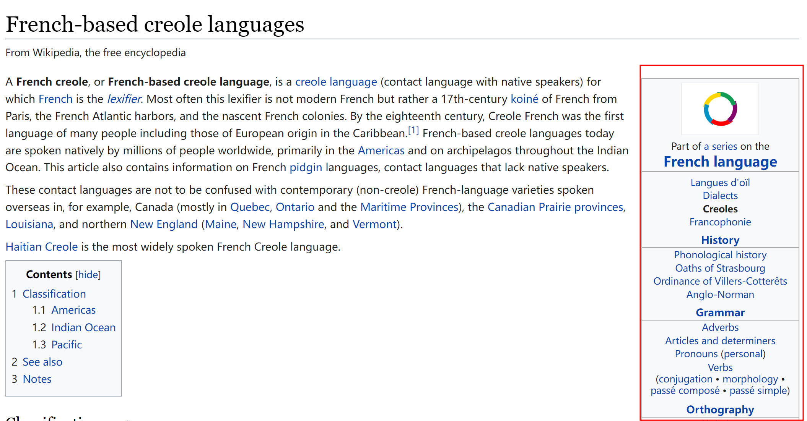

# TydiQA 数据处理与考虑

TydiQA 为多语言阅读理解数据集。文章从wiki百科中爬取，题目以及对应的标注由人工实现。Tydi数据库中包含了 18万+篇 wiki 百科预料，20万+ 文章问题，共涉及 11 种不同的语言。

## 目录
- [TydiQA 数据处理与考虑](#tydiqa-数据处理与考虑)
  - [1. 仓库预览](#1-仓库预览)
  - [2. Tydi 数据集介绍](#2-tydi-数据集介绍)
  - [4. Tydi QA 多语言阅读理解任务](#4-tydi-qa-多语言阅读理解任务)
  - [5. 数据集处理pipeline](#5-数据集处理pipeline)
    - [5. 1总结](#5-1总结)
    - [5. 2数据处理细节](#5-2数据处理细节)
  - [6. 任务处理细节](#6-任务处理细节)
  - [7. 其他](#7-其他)
    - [7.1 **关于 canine 微调 tydi**](#71-关于-canine-微调-tydi)
## 1. 仓库预览

本仓库数据处理流程与 canine [论文仓库](https://github.com/google-research/language/tree/b76d2230156abec5c8d241073cdccbb36f66d1de/language/canine/tydiqa) 一致，以下文件复制于 [canine/tydiqa](https://github.com/google-research/language/tree/b76d2230156abec5c8d241073cdccbb36f66d1de/language/canine/tydiqa)，除注释和代码缩紧外无更改：

+ `tydi_tokenization_interface.py`：Tydi 官方 Tokenizer 模板。

+ `char_splitter.py`：为 canine 模型专门设计的 TydiQA Tokenizer。
+ `data.py` ：提供所有 TydiQA 数据处理所需要的基础解析函数。如 `byte_slice()` 等。
+ `debug.py`：提供debug相关打印方法，为 tf 外的框架和模型做 Tydi 数据适配的时候会用到。
+ `special_codepoints.py`：储存 canine 模型的特殊编码。
+ `preproc.py`：生成 TydiQA 任务训练数据（`input_ids` 等）。

以下文件参考  [canine/tydiqa](https://github.com/google-research/language/tree/b76d2230156abec5c8d241073cdccbb36f66d1de/language/canine/tydiqa) 并进行了修改：

+ `pd_io.py`：转 TydiQA 数据到训练数据。[canine 原代码](https://github.com/google-research/language/blob/master/language/canine/tydiqa/tf_io.py) 训练数据格式为 tf.tensor，现改为 list。 
+ `postproc.py`：提供将logits输出转化为 Tydi 评估文件的模块。本次复现对其进行了内存优化、引入多线程计算 Tydi 评估文件。 
+ `prepare_tydi_data.py`：储存训练数据。[原代码](https://github.com/google-research/language/blob/master/language/canine/tydiqa/prepare_tydi_data.py) 采用 tfrecord 储存数据，现改为使用 h5df。
+ `run_tydi_lib.py`：负责 tydi 任务微调、预测和评估。根据个人设备条件，修改了[原代码](https://github.com/google-research/language/blob/master/language/canine/tydiqa/run_tydi_lib.py) 中的数据处理方式，超级参数等训练配置与官方一致。

其他文件为paddle canine专门编写：

+ `tydi_modeling.py`：针对 TydiQA 设计的 `CanineTydiQA` 模型
+ `data_utils.py`：定义该任务的`Dataset` 和 `Dataloader` 。

以下对该数据集做总结，你可以快速地对Tydi数据集和其处理方式有一个基本的了解。

## 2. Tydi 数据集介绍

从官方下载的文件格式为 `jsonl.gz`。读取解压后的每行 json 数据对应一篇wiki文章和标注，其中包括：


+ `document_plaintext` ：网页原文内容，文章均为wiki百科爬取，因此除正文外，`document_plaintext ` 中还会包含如下图右边这种信息。



+ `document_title`：文章标题，如上图案例标题为 French-based creole languages。
+ `document_url`：原文链接。
+ `example_id`：每个（文章-问题）对应一个单独id。
+ `language`：文章的语言，包括：  <u>ARABIC，BENGALI，  FINNISH，  INDONESIAN， JAPANESE，  SWAHILI， KOREAN， RUSSIAN， TELUGU， THAI， ENGLISH</u>
+ `passage_answer_candidates: List[Dict]`：文中每个段落在 `document_plaintext` 中的 byte 索引。

```json
// passage_answer_candidates 内容示例
{'plaintext_end_byte': 494, 'plaintext_start_byte': 1}
```

+ `question_text`：问题。每个文章仅对应一个问题。
+ `annotations:List[Dict]` ：包含了答案标注的信息。训练集中一个 `annotations` 中会存在多个答案标注。列表中的元素案例：

```json
// annotations 内容示例
{'annotation_id': 9676129447864545067, 'minimal_answer': {'plaintext_end_byte': -1, 'plaintext_start_byte': -1}, 'passage_answer': {'candidate_index': -1}, 'yes_no_answer': 'NONE'}
```

## 4. Tydi QA 多语言阅读理解任务

+ **Passage Selection Task** - 返回问题答案所在段落索引，无答案则返回-1

+ **Minimal Answer Span Task** - 返回问题答案对于全文的索引，无答案则返回-1
+ 对于是非判断题，仅需返回yes，no即可。 

## 5. 数据集处理pipeline

### 5. 1总结

使用大小为 `max_seq_length=2048` 的滑动窗口对每篇文章进行样本抽取。滑动的间隔 `doc_stride` 为 `512`。即一篇3000字的文章可以生成 `[0:2048],[512:2560],[2560:3000]` 三个样本。

### 5. 2数据处理细节

**处理流程**：一篇文章 -> 一行 jsonl 数据 -> 一个 `entry`  ->  一个 `TydiExample`  ->多个 `InputFeatures` ；

根据 canine 基线方案的数据处理方式，一个 `TydiExample` 中存有一篇文章的问答信息；`InputFeatures` 是对文章根据模型 `max_seq_length` 进行截断后，生成的截断问答信息，因此一篇文章能够生成多个 `InputFeatures`。

+ json 到 `entry`：（ `preproc.py.create_entry_from_json`）

```python
# json_dict 为每行原始数据集。
entry = {
    "name": json_dict["document_title"],
    "id": str(json_dict["example_id"]),
    "language": json_dict["language"],
    "plaintext" = json_dict["document_plaintext"]，  # 原始数据集的文章内容
    "question": {"input_text": json_dict["question_text"]},
    "answer": {
        "candidate_id": annotated_idx,
        "span_text": "",   # 答案内容`data.byte_slice(所在段落, 答案beg, 答案end)`
        "span_start": -1,  # 答案对于contexts的索引
        "span_end": -1,    # 答案对于contexts的索引
        "input_text": "passage",  # or minimal, yes, no。 表示回答类别
    }
    "has_correct_context": bool,  # == annotated_idx in context_idxs
    "contexts": str,  # 处理后的文章内容

    # 相对于context主要为plain text添加了特殊编码，同时去除了无用的段落间`\n`等符号。
    # 使用 特殊 符号来划分段落，对应的编码为 vocab['[Q]']+i,i为段落序号
    "context_to_plaintext_offset": Dict[int, int],
    # contexts[i] = plaintext[context_to_plaintext_offset[i]]
}
```

+ `entry` 到 `TydiExample`

```python
class TyDiExample(object):
    def __init__(self,
                 example_id: int(entry["id"]),
                 language_id: get_language_id(entry["language"]), # 语言通过枚举类储存
                 question: Text,  # entry["question"]["input_text"]
                 contexts: Text,  # entry["contexts"]
                 plaintext: Text,  # entry["plaintext"]
                 context_to_plaintext_offset: Sequence[int],
                 # entry["context_to_plaintext_offset"]
                 answer: Optional[Answer] = None,  
                 # answer 包括了 answer type，text 和 offset(start byte idx)
                 # 如果为 is_training, answer中元素就是全None
                 start_byte_offset: Optional[int] = None,  
                 # entry["answer"]["span_start"]
                 end_byte_offset: Optional[int] = None):
        		 # answer.offset + byte_len(answer.text)
```

+ `TydiExample` 到 `InputFeatures`

```python
class InputFeatures(object):
    def __init__(self,
                 unique_id: int,  
                 example_index: int,  # tydi_example.example_id
                 language_id: data.Language,  # tydi_example.language_id
                 doc_span_index: int,  # 文章根据 doc_stride 分区，当前段落所在分区索引。
                 wp_start_offset: Sequence[int],  # input_ids 在 plaintext中的byte索引
                 # byteslice(plain_text,wp_start_offset[i]) == chr(input_ids[start_position])
                 wp_end_offset: Sequence[int],
                 input_ids: Sequence[int],  # input_ids: id of "[CLS][Q] question [SEP] context"
                 input_mask: Sequence[int],
                 segment_ids: Sequence[int],  # 0/1 to clarify question and context 
                 start_position: Optional[int] = None,  
                 # answer 在 input_ids 中的位置
                 # input_ids[start_position:end_position+1] = answer
                 end_position: Optional[int] = None,
                 answer_text: Text = "",  # google 代码中的 answer_text 计算错误。
                 answer_type: data.AnswerType = data.AnswerType.MINIMAL):
```

## 6. 任务处理细节

**Canine 基线将 tydi 任务答案分成了四类**：

1. `None`：不存在答案。如上面这个 `annotation_id` 例子就是不存在答案。
2. `yes_or_not`：`annotation`中的`yes_no_answer`查看。值范围为`yes/no/none`。如对问题 Is Creole a pidgin of French? 答案为 YES。若非是非问题，则值为 none
3. `passage_index`：`annotation` 中的`'passage_answer'` 查看。值为答案在`passage_answer_candidates` 中的索引，如` {'candidate_index': 1}` 。段落索引从1开始
4. `min_answer`：`annotation` 中的 `minimal_answer` 查看。值为答案在 `document_plaintext` 中的索引。一般如果存在 `min_answer` 的话，`passage_index` 也是存在的

**重要！！！！Tydi数据集采用byte索引标注，因此对于 Python 3，需要注意字符串索引的使用方式。Python 3 默认对文本采用character encoding**

```python
def byte_slice(text, start, end, errors="replace"):
    return byte_str(text)[start:end].decode("utf-8", errors=errors)
```

如果采用python原始索引 `s[start:end]`的话，所有的内容都是对不准的。

**文中多个答案，如何处理？**

> Returns the annotation with the earliest minimal answer span. If no annotation has a minimal answer span, then the annotation with the earliest passage answer will be returned.
>

**文章截断方式**

由于模型对输入长度限制，因此需要对文章截断。canine 将需要截取的位置信息储存与 `doc_spans`中。

`doc_spans`:  储存每个doc_span 对应文章中的 `[start,start+length]` 内容，如果内容中包含了答案，那么将这个 `doc_span` 处理成 `InputFeatures`

```python
[DocSpan(start=0, length=468), DocSpan(start=128, length=468),...,DocSpan(start=11136, length=468)]  # length 由模型 max_len_seq 决定
```

对于没有涵盖答案的样本，有 `include_unkowns=0.1` 的概率接受这个训练样本。

```python
# If an example has unknown answer type or does not contain the answer
# span, then we only include it with probability --include_unknowns.
# When we include an example with unknown answer type, we set the first
# token of the passage to be the annotated short span.
if (include_unknowns < 0 or random.random() > include_unknowns): 
	continue  # canine 采用 include_unkowns = 0.1	
```

## 7. 其他

### 7.1 **关于 canine 微调 tydi**

**若采用 canine 仓库的 finetune设置，canine的实际训练量约是mBert的2倍多。**canine与其对标的mBert在训练数据集上存在差异。根据 mbert 的 tydi baseline [link](https://github.com/google-research-datasets/tydiqa/tree/master/baseline)，其数据处理方案与 canine 大同小异，仅是超参的数值不同。mbert 采用 128 的训练采样间隔，而canine使用 512 的采样间隔。但由于两者均**有 0.9 的概率忽略掉不含答案的样本**，因此经过测试与计算，mBert 平均每1篇文章能够生成4.27个样本，而 canine平均每一篇仅有约2.7个样本。 

尽管如此，微调时 mbert 仅用了 3个epoch，而 canine 微调了10个epoch。因此 canine 训练的样本量约是 mBert 的 `10*2.7/(4.27*3)=2.1` 倍。

**由于采样间隔不同，验证时候两者对同一篇文章的预测次数也不同。**由于双方都采用所有预测中cls得分最高的结果，很难说 mBert 更紧凑及更多的预测能否为其带来效果上的提升。因此，论文中 canine-s 比 mBERT 高出1至2个百分点的结果，很可能是任务数据处理方案不同导致的。

> **采样间隔：**对于文章长度超过 `max_seq_length` 的样本，使用长度为 `max_seq_length` 的窗口进行滑动采样，每次滑动的距离`stride` 即为采样间隔。

**最后，canine较长的 max_length 更有利于 tydiqa 任务。**canine输入长度达到了2048，是mBERT的4倍。考虑采样时到有0.9的概率忽略掉不含答案的样本（若样本中仅包含了一部分答案，那么也算不含答案），因此canine的训练集中包含答案的样本会更多。此外在验证集中，答案被预测窗口切割的情况也会减少，从而使得canine在tydiqa中优势大一些。
